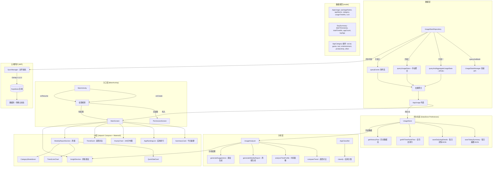
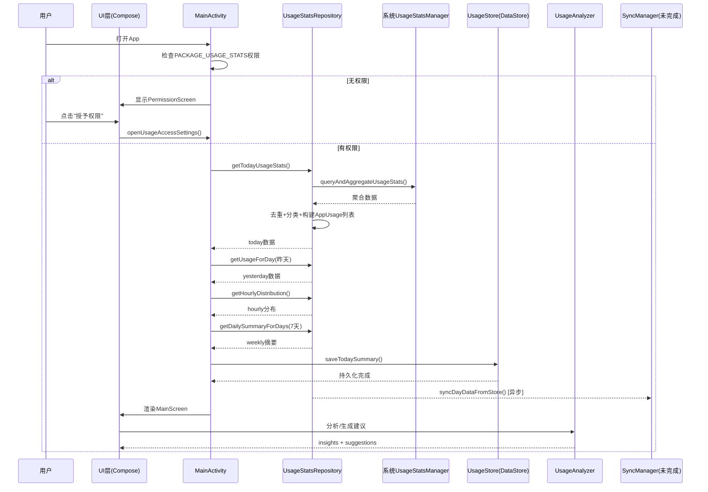

# ApplicationUseTime 项目架构总结

## 数据流图

## 关键指标

| 指标 | 值 |
|------|-----|
| Kotlin文件数 | 633 |
| 总代码节点 | 6,658 |
| 关系边数 | 11,163 |
| 最热函数 | `formatDuration` (被6处调用) |
| 核心类 | `UsageStatsRepository` (7处调用者) |
| 编译SDK | 37 (Android 15) |
| 最小SDK | 24 (Android 7.0) |
| 当前状态 | 本地功能完整，云端同步未完成 |

## 待办问题

1. **SyncManager.kt 缺失** — UsageStatsRepository 第168行调用了 SyncManager.syncDayDataFromStore()，但该文件不存在
2. **Supabase SDK 未集成** — 当前仅依赖 OkHttp 自定义实现，未使用 supabase-kt SDK
3. **无 ViewModel** — 状态全在 MainActivity, 可重构为 ViewModel + StateFlow 模式
4. **无测试覆盖** — 仅有 ExampleUnitTest 占位测试